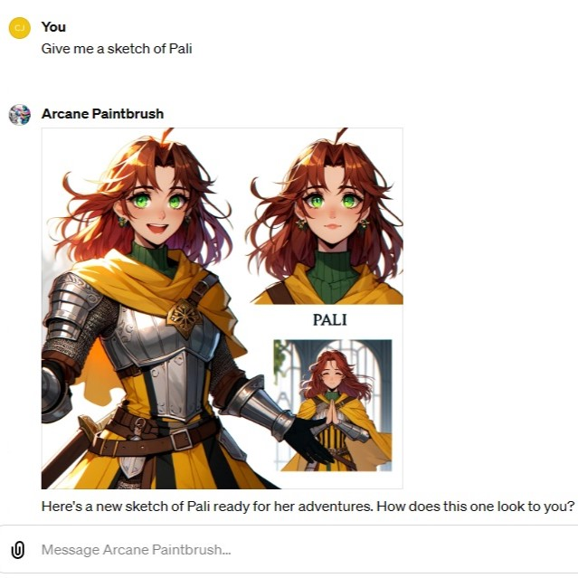

# OpenAI GPTs

## The Arcane Paintbrush

An illustrator for role-playing game characters. Attempts to use a consistent
fantasy art style, responding to requests such as "sketches" or "studies" in a
consistent manner.

* [GPT link](https://chat.openai.com/g/g-3R9svhPj5-arcane-paintbrush)

### Behind the scenes

* GPT uses **actions** to download knowledge documents from GitHub API.
* GPT actions call **AWS Lambda** functions to perform ETL on D&D Beyond data.
* GPT actions use secrets, i.e. API access token(s).

## Vector Le Magnifique

An illustrator for corporate presentations.

* [GPT link](https://chat.openai.com/g/g-wagBADp7N-vector-le-magnifique)
